# Comprehensive IBM Sterling OMS Consultant Master Guide: Architecture, Implementation, and Extensibility

**Key Points**
* IBM Sterling Order Management System (OMS) is a comprehensive, centralized orchestration platform designed to manage the entire order lifecycle across disparate systems and channels, orchestrating cross-channel selling and fulfillment.
* The system’s logical architecture heavily relies on precise Participant Modeling, utilizing constructs like Hub, Enterprise, Node, and Buyer/Seller to define operational boundaries, access controls, and data ownership.
* Workflow execution is rigorously governed by process types, pipelines, conditions, events, and Time-Triggered Transactions (Agents) that process tasks asynchronously using robust queuing mechanisms such as the `YFS_TASK_Q` table.
* Inventory visibility and promising are handled via the Real-Time Availability Monitor (RTAM), which applies Available-To-Promise (ATP) rules and generates delta updates for external catalog caches via `REALTIME_AVAILABILITY_CHANGE` events.
* Extensibility must strictly adhere to "Cloud Guardrails" in Order Management on Cloud (OMOC) environments, emphasizing upgrade-safe overlays, custom Service Definition Framework (SDF) implementations, and strict database extension guidelines involving Custom and Hang-off tables.
* It seems highly likely that mastering the intricacies of payment orchestration—such as leveraging the `recordExternalCharges` API alongside the `YFSCollectionOthersUE` user exit—is critical for implementing edge-case workflows like Cash on Delivery (COD) and Wallet payments without violating the base settlement logic.

**Overview of the Master Guide**
The modern supply chain requires unprecedented agility. Organizations are increasingly relying on distributed, multi-node fulfillment networks to meet consumer demands for speed and transparency. IBM Sterling OMS serves as the digital backbone for these operations. This comprehensive consultant master guide synthesizes technical architecture, business logic configuration, and deployment strategies into an authoritative resource for enterprise architects and OMS consultants. 

The guide is divided into specialized domains: Enterprise Modeling, Pipeline & Process Modeling, Inventory Management, Fulfillment Operations, Reverse Logistics, Payment Lifecycle, and Technical Extensibility.

---

## 1. Introduction to IBM Sterling OMS

IBM Sterling Order Management System (OMS) is an enterprise-grade software solution that brokers orders across many disparate systems, orchestrates and automates cross-channel selling and fulfillment processes, and provides a global view of supply and demand across the supply chain. The platform is built on a Service-Oriented Architecture (SOA), allowing businesses to abstract the complexity of their backend Enterprise Resource Planning (ERP), Warehouse Management Systems (WMS), and Transportation Management Systems (TMS) from the front-end commerce and point-of-sale (POS) channels.

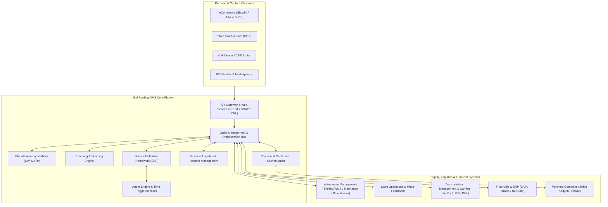

The platform is underpinned by the Sterling Application Platform, a collection of common components and foundational data structures used across the application. These components provide the infrastructure upon which all other business application modules are built, supporting a highly customizable relational schema known as the Sterling Data Model, which houses critical tables such as `YFS_ORDER_HEADER`, `YFS_ORDER_LINE`, and `YFS_INVENTORY_ITEM`.

---

## 2. Deep Dive into Enterprise Modeling

At the core of the Sterling OMS architecture is a robust organizational modeling framework known as Participant Modeling. This framework defines the legal, physical, and logical entities that interact within the supply chain network. The Applications Manager Configurator is utilized to create and maintain these organizations, define their roles, establish the services they provide, and configure the business elements required for collaborative processes.

### Participant Modeling: Hub, Enterprise, Seller, Buyer, and Node
Participant Modeling allows for the configuration of a multi-enterprise, multi-tenant marketplace. A marketplace acts as an online intermediary connecting Buyers and Sellers, aggregating offerings to eliminate inefficiencies and lower transaction costs.

1. **Hub**: The Hub is the central location and trusted intermediary that integrates procedures and technology. It is the root organization in the Sterling OMS hierarchy. System-wide configurations, generic document routing, and base application rules are often owned by the Hub. 
2. **Enterprise**: In the marketplace model, each market or distinct business unit can be set up as an Enterprise. This setup allows each market to be unique, possessing its own product handling, inventory separation, and business rules. The Enterprise represents the legal entity that owns the catalog, pricing, and the overarching lifecycle of an order.
3. **Seller and Buyer**: These are counterparties in a transaction. Organizations can be configured explicitly as Sellers (who provide goods/services) and Buyers (who procure them). An organization can hold multiple roles simultaneously depending on the context of the transaction.
4. **Node**: Nodes represent physical or virtual locations where inventory is held and fulfillment occurs. Examples include distribution centers (DCs), retail stores, third-party logistics (3PL) warehouses, and drop-ship vendors. Nodes are mapped to an organization and often act as the executing entities for warehouse operations.
5. **Carrier**: Logistics providers responsible for moving inventory between Nodes or from a Node to a Buyer. 

### Organization Hierarchy and Rule Inheritance Flow

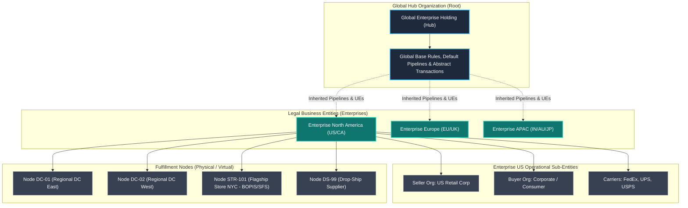

### Rule Inheritance
To reduce duplication of configuration and enforce standardization across multiple brands or subsidiaries, Sterling OMS utilizes **Enhanced Inheritance for Process Models**. When an organization acts as an Enterprise, it inherits pipelines, user exits, services, actions, conditions, statuses, transactions, and events from parent Enterprises or the Hub, overriding only local legal or tax exceptions.

---

## 3. Pipeline & Process Modeling

Process Modeling is the engine that drives document lifecycles within Sterling OMS. It defines the sequence of statuses a document (like a Sales Order, Return, or Quote) goes through, governed by business rules and transactional logic. 

### End-to-End Order-to-Cash (O2C) Fulfillment Pipeline

```mermaid
graph LR
    Draft["Draft Order (1000)"] --> CreateOrder["Create Order (1100.01)0"]
    CreateOrder --> Created["Created (1100)"]
    
    Created --> FraudCheck{"Fraud & Risk Check"}
    FraudCheck -- "Flagged" --> FraudHold["On Fraud Hold (1100.100)"]
    FraudHold -- "Manually Cleared" --> PayAuth
    FraudCheck -- "Approved" --> PayAuth["Payment Authorization (1100.200)"]
    
    PayAuth --> AuthApproved{"Auth Success?"}
    AuthApproved -- "Failed" --> PayHold["On Payment Hold"]
    AuthApproved -- "Authorized" --> Sched["Schedule Order (1300)"]
    
    Sched --> SchedCheck{"Inventory Available?"}
    SchedCheck -- "No Stock" --> Backorder["Backordered (1300.100)"]
    SchedCheck -- "Procure Needed" --> ProcureTO["Procurement PO/TO Created"]
    SchedCheck -- "Stock Available" --> Scheduled["Scheduled (1500)"]
    
    Scheduled --> Release["Release Order (2160)"]
    Release --> Released["Released to Node (3200)"]
    
    Released --> WMSFlow["WMS Wave, Pick & Pack"]
    WMSFlow --> Shipped["Shipped (3700)"]
    
    Shipped --> Invoice["Create Invoice & Settle (3700.100)"]
    Invoice --> Closed["Order Closed / Completed (9000)"]

    classDef holdStyle fill:#7f1d1d,stroke:#f87171,stroke-width:2px,color:#fef2f2;
    classDef successStyle fill:#064e3b,stroke:#34d399,stroke-width:2px,color:#ecfdf5;
    classDef stateStyle fill:#1e293b,stroke:#94a3b8,stroke-width:1px,color:#f8fafc;
    class FraudHold,PayHold,Backorder holdStyle;
    class Shipped,Invoice,Closed successStyle;
    class Draft,Created,Scheduled,Released,ProcureTO stateStyle;
```

### Transactions: Concrete, Abstract, and Time-Triggered
Transactions are the functional nodes within a pipeline that move a document from one status to another.
* **Abstract Transactions**: Base templates provided by the system representing generic business logic (e.g., "Schedule Order" or "Release Order"). They cannot be used directly in a pipeline without being derived.
* **Concrete Transactions**: Instantiations of abstract transactions configured with specific drop-statuses and pick-statuses tailored to an Enterprise's pipeline. 

### Asynchronous Task Queue (`YFS_TASK_Q`) & Agent Server Architecture

Time-Triggered Transactions (Agents) run in the background on an Agent Server. They poll the `YFS_TASK_Q` table or external JMS queues, processing records in multithreaded batches.

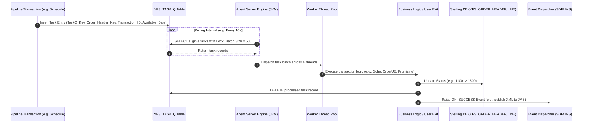

### Task Queues and Task Queue Synchers
When a pipeline is dynamically modified (e.g., adding a custom "Address Verification" transaction between "Create" and "Schedule"), in-flight orders lack task queue records for the new step. 

Sterling OMS provides five **Task Queue Synchers** to scan database tables and generate missing entries:
1. `Load execution task queue syncher`
2. `Order delivery task queue syncher`
3. `Order fulfillment task queue syncher`
4. `Order negotiation task queue syncher`
5. `Quote fulfillment task queue syncher`

---

## 4. Inventory Management & Promising

Omnichannel success hinges on accurate, real-time inventory visibility and intelligent order promising. Sterling OMS provides a global view of supply and demand across distribution centers, stores, and suppliers.

### Supply and Demand Types & Available-to-Promise (ATP) Equation

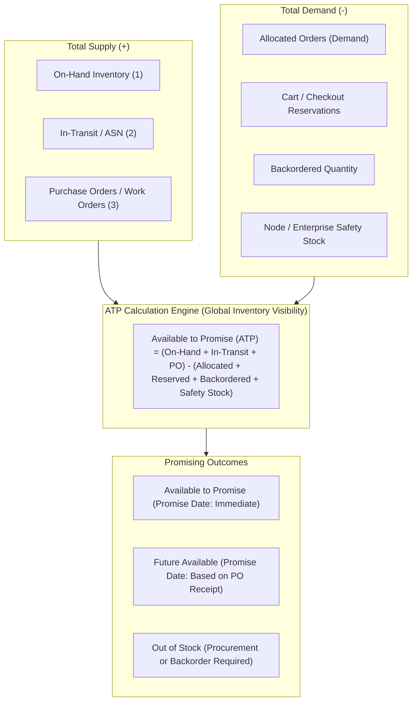

### Real-Time Availability Monitor (RTAM) Delta Publishing Architecture

RTAM monitors inventory changes and publishes delta updates to external storefronts only when predefined quantity thresholds are crossed, minimizing API traffic.

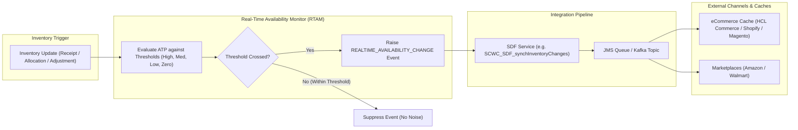

### Sourcing and Sourcing Decision Tree

When an order line is scheduled, Sterling OMS evaluates sourcing rules across all eligible fulfillment nodes.

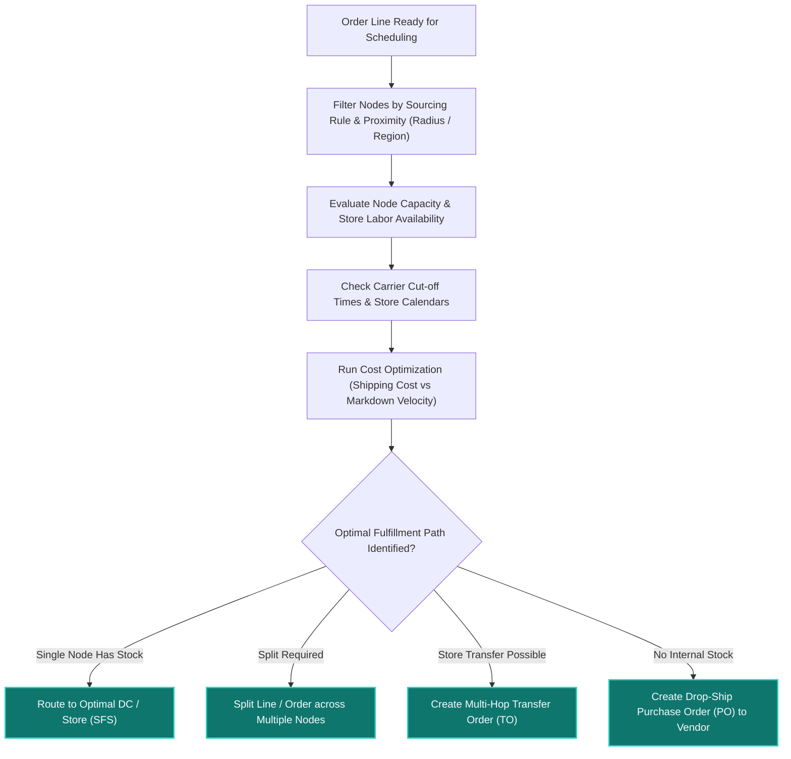

---

## 5. Fulfillment & Store Operations

Fulfillment bridges digital order commitments with physical warehouse and store execution.

### Omnichannel Fulfillment Architectures: BOPIS, SFS, and BOSS

```mermaid
graph TB
    subgraph BOPIS["BOPIS (Buy Online Pick Up In Store)"]
        B1["Order Placed with Store Pickup"] --> B2["Reserve Store Inventory"]
        B2 --> B3["Store Associate Pick & Pack"]
        B3 --> B4["Customer Notified (Ready for Pickup)"]
        B4 --> B5["Customer Handover / OTP Verification"]
    end

    subgraph SFS["SFS (Ship From Store)"]
        S1["Order Routed to Local Store"] --> S2["Evaluate Store Capacity"]
        S2 --> S3["Pick-to-Tote by Associate"]
        S3 --> S4["Pack Carton & Generate Carrier Label"]
        S4 --> S5["Carrier Pickup & Dispatch"]
    end

    subgraph BOSS["BOSS (Buy Online Ship to Store)"]
        O1["Customer Selects Store Pickup (Out of Local Stock)"] --> O2["Fulfill from Central DC"]
        O2 --> O3["Create Chained Transfer Order (DC -> Store)"]
        O3 --> O4["Store Receives Transfer Shipment"]
        O4 --> O5["Ready for Pickup Notification"]
    end
```

### Warehouse Execution Lifecycle (Wave $\to$ Pick $\to$ Pack $\to$ Manifest)

---

## 6. Reverse Logistics & Returns

Returns represent 20–30% of eCommerce volume. Sterling OMS manages returns as dedicated document types moving through specialized Return Fulfillment pipelines.

### End-to-End Reverse Logistics & Disposition Workflow

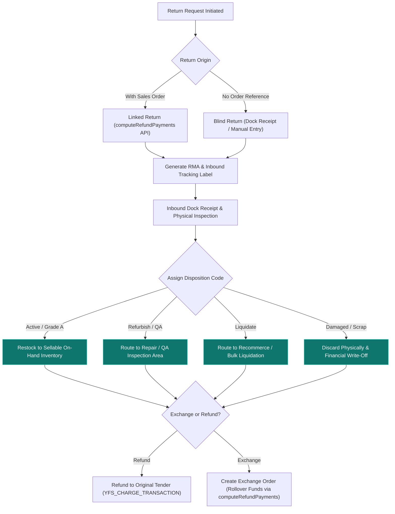

### Linked Returns vs. Exchange Settlement

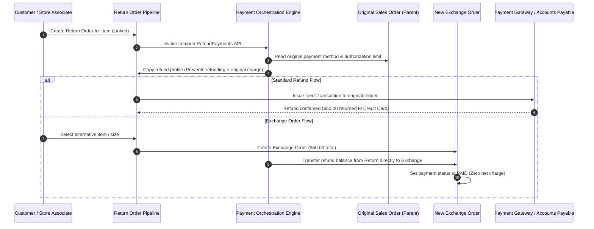

---

## 7. Payment & Invoicing Lifecycle

Payment orchestration is modular, designed to interface asynchronously with payment gateways while maintaining strict state separation between fulfillment and financial settlement.

### Payment State Machine

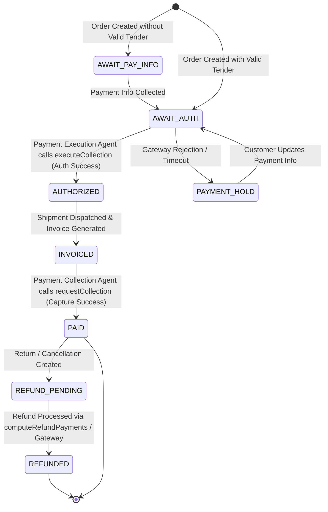

### Standard Authorization & Settlement Sequence

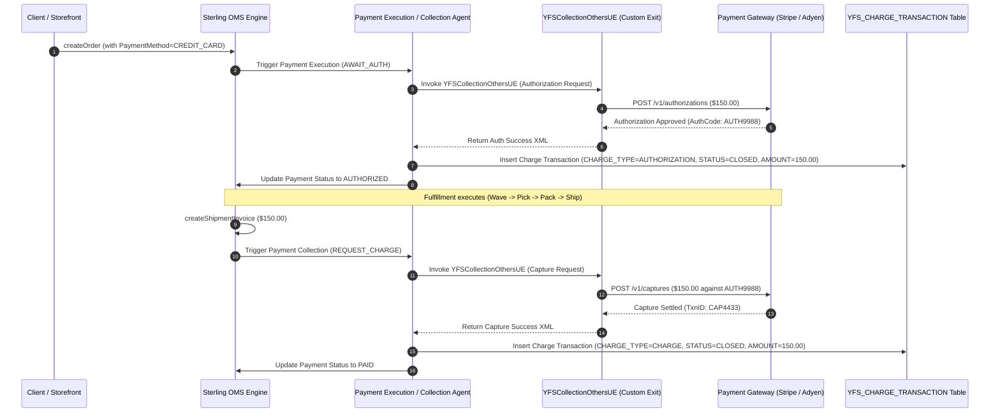

### Case Study: Cash on Delivery (COD) & External Charges Reconciliation

Handling Cash on Delivery (COD) requires bypassing standard gateway authorization and reconciling physical cash collections reported by logistics carriers.

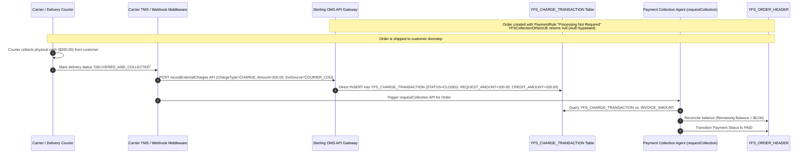

---

## 8. Technical Extensibility & Cloud Guardrails

To adapt the base product to enterprise requirements, consultants leverage the Service Definition Framework (SDF), custom Java APIs, and schema extensions while adhering strictly to Order Management on Cloud (OMOC) guardrails.

### Service Definition Framework (SDF) Integration Architecture

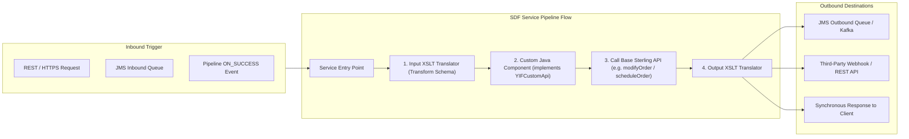

### Database Extensibility: Hang-off Tables & Locking Architecture

A **Hang-off table** possesses a many-to-one relationship with a base table (e.g., custom attributes or tracking entries linked to `YFS_ORDER_HEADER`).

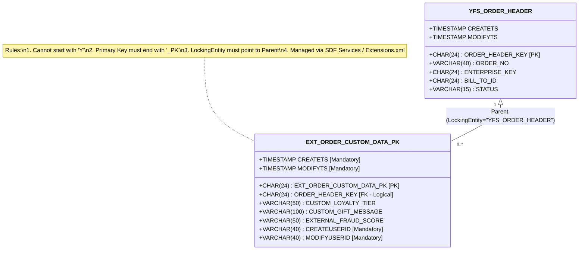

### OMOC Cloud Guardrails & Configuration Deployment Tool (CDT) Pipeline

In IBM Sterling OMOC SaaS, direct schema edits and manual DDL scripts are strictly prohibited. Configuration must be promoted across environments via CDT.

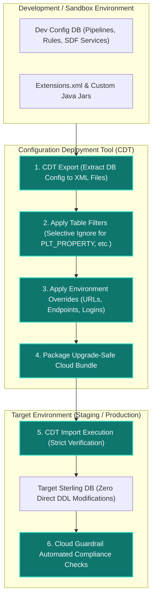

### Performance Tuning for Peak Scale

| Strategy | Technical Mechanism | Impact on Peak Throughput |
| :--- | :--- | :--- |
| **Complex Query Syntax** | Use `AND` / `OR` query syntax in API input XML rather than broad retrieval. | Reduces payload size and database memory pressure by >70%. |
| **Index Optimization** | Remove unnecessary OOTB indexes (e.g. `PERSON_INFO_I4`) on heavy-write tables. | Reduces I/O locking during massive flash-sale order insert spikes. |
| **Transaction Caching** | Enable transaction-level caching on static/infrequent tables (`YFS_INVENTORY_TAG`). | Eliminates redundant round-trip SQL queries across agent threads. |
| **Task Queue Batch Tuning** | Set batch sizes (e.g., 200–500) and thread counts aligned with DB CPU cores. | Maximizes throughput while avoiding database deadlocks. |

---

*End of Guide. This document encapsulates the architectural principles, operational processes, diagrams, state machines, and technical guardrails required to successfully implement and scale IBM Sterling Order Management System in a modern enterprise environment.*
